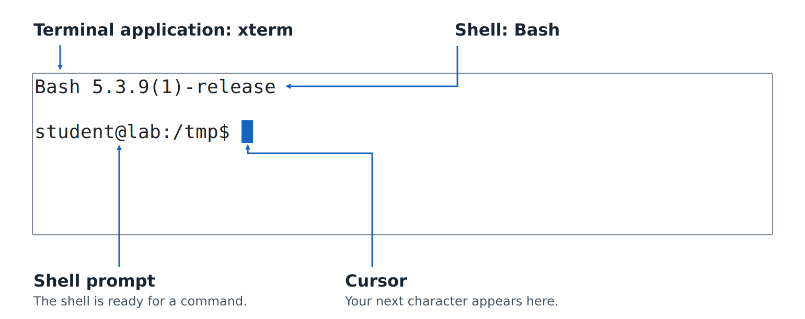

# Meet Your Terminal and Shell

Before you start giving the computer commands, get comfortable with the place where you will type them.
You will spend a lot of time here.
Being able to open another session, find something that scrolled away, and copy an error message makes that time much more productive.

In this chapter you will open a terminal, meet the shells it can run, read a prompt, and learn to use the window around the command line.
You do not need to install a collection of hacker tools first.
Start with the terminal available on your computer.

## Terminal, Shell, and Operating System

A **terminal application** displays text from programs and passes your keyboard input to them.
You may also hear it called a **terminal emulator**.
It does the job once performed by a separate terminal device attached to a computer. [@GnomeTerminalIntro]

The **shell** is the program that interprets the commands you type.
It can do some work itself and start other programs to do the rest.
Bash, zsh, PowerShell, and Command Prompt are shells.

The **operating system**, or **OS**, manages resources such as files, running programs, and devices.
Windows, macOS, and Linux are operating systems you will encounter in this book.

These pieces work together, but they have different jobs:

| Piece | What you do with it | Examples |
|---|---|---|
| Terminal | Open tabs, copy displayed text, change the font | Windows Terminal, macOS Terminal, GNOME Terminal |
| Shell | Enter commands, recall previous commands, connect programs | PowerShell, Command Prompt, Bash, zsh |
| Operating system | Store files, run processes, control access to resources | Windows, macOS, Linux |

Changing the terminal's background color does not change the language your shell understands.
Opening a different shell in the same terminal can change that language completely.
That distinction will explain a lot of otherwise mysterious behavior.

We will use **console** informally for this command-line workspace.
When a distinction matters, we will name the terminal, shell, or operating system explicitly.

In the screen capture below, **xterm** is the terminal application and **Bash** is the shell running inside it.
The **shell prompt** is the text Bash displays when it is ready for a command.
The **cursor** is the blue block marking where the next character you type will appear.

{width=100%}

The shell label points to Bash's version banner to show which program is handling this session.
Linux is the operating system supporting both programs.

## Open a Terminal

Follow the section for your computer.
You can read the other sections to recognize the tools your classmates use.

### Windows

Open the Start menu, search for **Terminal**, and launch Windows Terminal if it is installed.
Its tab dropdown lets you choose among available profiles, such as Windows PowerShell, PowerShell, and Command Prompt.
Windows Terminal supports multiple shells in one application. [@WindowsTerminalOverview]

If Terminal is not available, search Start for **Windows PowerShell** or **Command Prompt** and open that instead.
You can try the commands there, though the window may not provide all the features described below.
The application hosting these shells depends on your Windows setup.

Choose a normal session for these chapters.
There is no need to select **Run as administrator**.

### macOS

Open Spotlight with `Command+Space`, search for **Terminal**, and open it.
You can also find Terminal in the Utilities folder inside Applications.
Apple's Terminal provides a command-line interface to macOS. [@AppleTerminalStart]

On a Mac, the `Command` key is the one marked `⌘`.
It is a different key from `Control`.
When the book says `Ctrl+C`, it means Control, even on a Mac.

### Linux

Open your desktop's application launcher and look for a terminal application.
Its name might be Terminal, GNOME Terminal, Console, or Konsole.
Linux desktops do not all ship the same application or assign the same shortcuts.
In this chapter, the Linux shortcut examples are specifically for **GNOME Terminal**.

If you already have a terminal open without a graphical desktop, you can still follow the command examples.
Tabs and graphical settings depend on the terminal application you use to connect.

### Inside an Editor

If you already use Visual Studio Code, select **Terminal > New Terminal**.
Its integrated terminal can run installed shells, and the dropdown beside the new-terminal button lets you select a profile. [@VSCodeTerminalBasics]

The terminal panel and the editor are separate places to type.
Entering a command into an open text file just adds text to that file.
Click inside the terminal panel when you want the shell to receive it.

## The Shells We Will Use

This book has two main tracks: Bash/zsh and PowerShell.
We will also cover Windows Command Prompt, because you will encounter instructions and tools that use it.

| Shell | Where you will encounter it | How this book uses it |
|---|---|---|
| **Bash** | Linux, macOS, and UNIX-style environments on Windows | A main shell for UNIX command-line work and scripts |
| **zsh** | macOS and systems where it has been installed | A main interactive UNIX shell, with differences from Bash called out |
| **PowerShell** | Windows; PowerShell 7 also runs on macOS and Linux | The main Windows track and its object-based approach to automation |
| **Command Prompt** (`cmd.exe`) | Windows | Native Windows commands and batch-file conventions |

An **interactive shell** reads commands as you enter them.
A **script** stores commands in a file so a shell can run them later.
We start interactively so that you can inspect each result before moving on.

Bash and zsh share much of their everyday command syntax, but they are different programs.
Where an example works in both, we will label it **Bash/zsh**.
Where the behavior differs, we will give separate examples.

Current macOS installations normally use zsh as the default shell in Terminal.
Your account or terminal settings can select another shell. [@AppleDefaultShell]
Linux systems also vary; your terminal's profile settings determine which shell it starts.

### Two PowerShells on Windows

**Windows PowerShell 5.1** and **PowerShell 7** are separate products.
Windows PowerShell comes with Windows and runs only on Windows; PowerShell 7 is also available for macOS and Linux. [@WindowsPowerShellOverview]

On Windows, `powershell.exe` starts Windows PowerShell, while `pwsh.exe` starts the newer PowerShell when it is installed.
Installing PowerShell 7 does not replace Windows PowerShell 5.1; they can exist side by side. [@PowerShellMigration]

Our main PowerShell track targets PowerShell 7.
The examples in this chapter also work in Windows PowerShell 5.1.
You can start with the version you already have; later chapters will mark examples that require newer features.

::: {.tip}
**Trap:** Updating Windows Terminal does not update the shell running inside it.
The terminal and PowerShell have their own versions.
When comparing your results with a tutorial, check which one the tutorial is talking about.
:::

### Windows Can Host More Than Windows Shells

Windows Subsystem for Linux, or **WSL**, lets you work in a Linux environment on Windows.
A WSL profile in Windows Terminal can therefore start a Linux shell.
The surrounding window still belongs to Windows Terminal. [@WindowsTerminalOverview]

You may also encounter **Git Bash**, the Bash environment supplied with Git for Windows.
It is a different environment from WSL. [@GitForWindows]
Record which environment you are using; it affects available commands and how paths work.
For now, you do not need either one to begin the Windows track.

## Read the Prompt

Here are examples of prompts you might see.
These are illustrations, not commands to type:

```text
student@laptop:~$
student@MacBook ~ %
PS C:\Users\student>
C:\Users\student>
```

The first two are typical UNIX-style prompts.
They show a username, a computer name, and a location; `~` commonly represents your home directory.
The last two resemble default PowerShell and Command Prompt prompts on Windows, including a path to the current directory.

A **directory** is what a graphical file manager calls a folder.
Your shell has a **current directory**, which gives commands a starting place for finding files.
We will explore directories properly in Chapter 4.

Prompts are customizable.
A `$`, `%`, or `>` at the end is a clue, not proof of which shell is running.
A tab title can also be renamed.
Look at your terminal's profile settings to see which shell it starts.

## Your First Round Trip

The shell normally displays a **prompt** when it is ready for a command.
The prompt may contain your username, the computer's name, or a folder path.
The examples above show how its appearance varies between shells.

Click beside the prompt, type the following line, and press Enter, or Return on a Mac:

```text
echo console-ready
```

This particular command works in Bash, zsh, PowerShell, and Command Prompt.
`echo` asks for the following text to be written as output.
The result should include:

```text
console-ready
```

Then the prompt returns.
You entered a command, the shell handled it, and the terminal displayed the result.
That is the basic conversation we will build on.

In this book, command blocks normally contain only what you should type.
Output appears separately.
When we show a complete conversation that includes a prompt, we will say so.

::: {.tip}
**Trap:** Do not type the prompt along with a command.
If a tutorial shows `$ echo hello`, the `$` may be its way of marking the prompt.
The command is `echo hello`.
:::

## Tabs, Panes, and Focus

A **tab** gives you another workspace inside the same terminal window.
Opening a new shell tab normally starts another shell session.
The shells can use the same files, but each has its own immediate state, such as the command currently being typed.

Open a second tab through your terminal's menu or new-tab button.
Type `echo second-tab` there, then return to the first tab.
Your original conversation should still be visible.
Two tabs let you keep two tasks within reach without mixing their output.

A **pane** is a section of a window.
Windows Terminal can split a tab into panes running separate sessions.
For example, hold `Alt` while selecting a profile in its dropdown to open that profile in a new pane.
Its default `Alt+Arrow` bindings move focus between panes. [@WindowsTerminalPanes]

**Focus** identifies which pane receives your typing.
Before entering a command, find the cursor or the active-pane highlight.
You can have the right command and still enter it in the wrong session.

Different terminal applications use the word *split* differently.
In macOS Terminal, **Split Pane** gives you another view of the same session's scrollback; use a new tab or window for a separate shell.
VS Code's terminal splits, by contrast, can host separate terminal sessions. [@AppleTerminalShortcuts; @VSCodeTerminalBasics]

## Copy and Paste Are Terminal Features

Select the output text `console-ready` with your mouse.
Use the terminal's Copy action, then paste it into a notes document.
Copying text is useful for recording results and asking a precise question about an error.

The following are default bindings in the named applications.
Your settings may override them. [@WindowsTerminalActions; @AppleTerminalShortcuts; @GnomeTerminalShortcuts]

| Action | Windows Terminal | macOS Terminal | GNOME Terminal |
|---|---|---|---|
| New tab | `Ctrl+Shift+T` | `Command+T` | `Ctrl+Shift+T` |
| Copy selected text | `Ctrl+Shift+C` | `Command+C` | `Ctrl+Shift+C` |
| Paste | `Ctrl+Shift+V` | `Command+V` | `Ctrl+Shift+V` |
| Search displayed text | `Ctrl+Shift+F` | `Command+F` | `Ctrl+Shift+F` |

`Ctrl+C` has another important job: it commonly requests that the current command stop, or cancels a line you are entering.
Some terminals also use it for copying when text is selected.
Using the explicit Copy action avoids that ambiguity.

To practice pasting a command, copy just `echo pasted-on-purpose` from this sentence.
Paste it at an empty prompt, inspect it, and press Enter.

::: {.tip}
**Trap:** A paste can contain more than one line, including an Enter character at the end.
Depending on the shell and terminal, that can execute commands immediately.
For this exercise, copy only the single command, without a newline.
:::

## Scrollback and Search

The terminal keeps a **scrollback buffer**: earlier displayed text you can revisit after it leaves the screen.
Run `echo another-line` several times, pressing Enter each time.
Make the window short enough that some output scrolls above the visible area.
Use the scrollbar or mouse wheel to look back.

Scrolling changes what you see.
It does not return the shell to an earlier point in time.
The shell is still waiting at its current prompt.

Use your terminal's Find action to search for `console-ready` in the first tab.
This searches text the terminal has retained.
It does not search the contents of files on disk.
Later we will use other tools for that.

**Command history** is different again: it records commands the shell remembers so you can recall and edit them.
Scrollback can include commands, output, and error messages.
History generally contains commands, not their output.

Neither feature should be your only record of important work.
Scrollback can be limited or cleared, and history retention depends on shell settings.
Put observations you want to keep into your notes.

## Make It Readable

Open your terminal's settings and find the font and color controls.
Choose a comfortable size and a color scheme where you can clearly read ordinary text, highlighted text, and errors.
A **monospaced font** gives each character the same width, helping columns line up.

Try increasing the font size, then restoring it.
Also resize the window and watch longer lines wrap.
A line wrapping on screen does not necessarily mean there is a newline in the underlying text.

A **terminal profile** is a saved set of settings.
Depending on the application, it can include appearance, the starting folder, and which program to launch.
In Windows Terminal, check the command line in a profile's settings to see what it starts.
Changing a profile's displayed name alone does not change its shell. [@WindowsTerminalOverview]

Do not confuse a terminal profile with a **PowerShell profile**.
The latter is a script PowerShell can run at startup; we will cover it when we configure shells.

In Windows Terminal, `Ctrl+Shift+P` opens the **command palette**.
It lets you find terminal actions by name, which is handy before you have memorized their shortcuts. [@WindowsTerminalPalette]
For other terminals, explore the menus and their displayed shortcuts.

## Closing a Session

At an idle shell prompt, enter:

```text
exit
```

In these shells, `exit` ends the current shell session.
If that shell was the main program in a tab, the terminal may close the tab or show that the session ended, depending on its settings.
You can open another session from the terminal's menu.

Closing a window can also affect programs still running inside it.
For now, return to an idle prompt before closing its tab.
We will study running programs and their lifetimes later.

## Key Points

- The terminal handles the window, displayed text, and interaction with programs; the shell interprets commands.
- Tabs and session panes let you keep separate conversations open.
- Focus determines where your typing goes.
- Clipboard actions and terminal search are different from shell editing and command history.
- Shortcuts belong to particular applications and configurations.
- Bash, zsh, PowerShell, and Command Prompt have different command languages; the terminal can host more than one of them.
- The shell prompt tells you it is ready, and the cursor shows where your next character will appear.

## Level Up

n00bs finish the chapter here.
You can open a terminal, recognize the shell and prompt, and use the window around them.
Hackers start asking what else is out there.

Start with other **terminal applications**:

- **iTerm2** on macOS: explore its split panes and search features. [@ITerm2Features]
- **kitty** on Linux or macOS: investigate its layouts and ability to display images inside the terminal. [@KittyOverview]
- **WezTerm** on Windows, macOS, or Linux: compare its tabs, panes, and configuration options with your current terminal. [@WezTerm]

Then look at other **shells**:

- **fish**: explore command suggestions and syntax highlighting as you type. [@FishTutorial]
- **Nushell**: look at how it represents command output as structured data, such as tables with named columns. [@Nushell]

Pick one that interests you and read its documentation.
What problem does it try to solve?
Which feature would make your own work easier?
If it runs on your system, try it in a separate session and compare it with the tools you already have.

Change one thing at a time.
Run a familiar shell in a different terminal to explore the terminal's features.
Run a different shell in the same terminal to explore the shell's behavior.
Notice which differences belong to which program.

You do not need to replace your everyday setup to explore an alternative.
The useful discovery is being able to explain what changed, why it changed, and whether it helps you.
